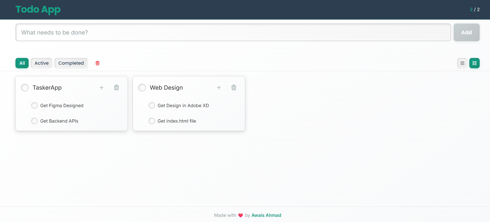

# AirTasker

**AirTasker** is not just a Todo App—it's your complete daily planner that helps you organize and manage your tasks efficiently.

## 🚀 Try It Live

You can use AirTasker for free at **[https://airtasker-seven.vercel.app/](https://airtasker-seven.vercel.app/)**. The app stores all your data in your browser using localStorage, ensuring your tasks persist across sessions while keeping your data private and secure.



## About AirTasker

AirTasker is a comprehensive task planning application built with React, TypeScript, and Vite. Unlike simple todo applications, AirTasker serves as your entire planning system, designed to help you structure and manage your daily tasks effectively.

## Features

- **Complete Daily Planner**: More than just a todo list—a full-featured planning system
- **Persistent Storage**: Uses Web APIs `localStorage` to ensure your tasks are saved and persist across browser sessions
- **Task Management**: Create, update, and organize your daily tasks with ease
- **Modern UI**: Built with React and TypeScript for a smooth, responsive user experience

## Technology Stack

- **React** - UI library
- **TypeScript** - Type-safe JavaScript
- **Vite** - Fast build tool and dev server
- **Web APIs** - `localStorage` for persistent data storage

## Getting Started

### Prerequisites

- Node.js (v18 or higher)
- npm or yarn

### Installation

1. Clone the repository
2. Install dependencies:
   ```bash
   npm install
   ```

3. Start the development server:
   ```bash
   npm run dev
   ```

4. Open your browser and navigate to the local development URL (typically `http://localhost:5173`)

## How It Works

AirTasker leverages the browser's `localStorage` Web API to automatically save your tasks. This means:
- Your tasks persist even after closing the browser
- No backend server required—everything runs in your browser
- Fast and reliable data storage

## Development

This project uses:
- React with TypeScript for type safety
- Vite for fast development and building
- ESLint for code quality

## Author

Created with ❤️ by [Awais Ahmad](https://github.com/itsahmadawais/)

---

**Note**: AirTasker uses `localStorage` for data persistence. Your tasks are stored locally in your browser and will remain available across sessions.
