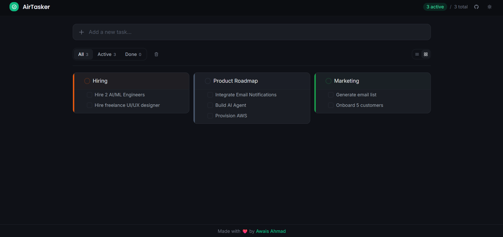

# AirTasker

[](https://airtasker-seven.vercel.app/)
[](https://react.dev/)
[](https://www.typescriptlang.org/)
[](https://tailwindcss.com/)
[](https://vitejs.dev/)
[](./LICENSE)

A feature-rich task manager with drag & drop, nested sub-tasks, color labels, dark/light mode, and list/grid views — built entirely in the browser with zero backend.

> **[→ Try it live](https://airtasker-seven.vercel.app/)** — no login, no setup, works instantly.

---



---

## ✨ Features

- **Drag & Drop Reordering** — Reposition both parent tasks and sub-tasks with intuitive drag handles, powered by `@dnd-kit` with separate sortable contexts per level
- **Sub-Task Management** — Break tasks into smaller sub-tasks with independent completion tracking
- **Color-Coded Labels** — 8 theme-aware color schemes to categorize and visually distinguish tasks
- **Dark & Light Mode** — Toggle between themes; preference persisted automatically
- **List & Grid Views** — Switch layouts with your preference remembered across sessions
- **Inline Editing** — Click any task or sub-task title to edit it in place
- **Filters** — Quickly filter by All, Active, or Completed tasks
- **Persistent Storage** — All tasks, view preferences, and theme choices saved via `localStorage`
- **Responsive Design** — Works seamlessly across desktop, tablet, and mobile
- **Zero Backend** — Entirely client-side, no auth, no API calls, instant load

---

## 🛠️ Tech Stack

| Technology | Purpose |
|---|---|
| **React 19** | UI library |
| **TypeScript** | Type-safe JavaScript |
| **Vite** | Build tool and dev server |
| **Tailwind CSS v4** | Utility-first styling |
| **@dnd-kit** | Drag-and-drop reordering |
| **localStorage** | Client-side data persistence |

---

## 💡 Design Decisions

**Zero backend by design**
All state lives in `localStorage` — instant load, works offline, and zero infrastructure cost. Not a limitation; a deliberate architectural choice for a tool that should just work.

**Separate sortable contexts for nested drag-and-drop**
`@dnd-kit` requires distinct `SortableContext` instances for nested lists. Parent tasks and sub-tasks each have their own context, preventing cross-level drag interference while keeping the state model flat.

**CSS custom properties for theme-aware color schemes**
Each of the 8 color labels has light and dark variants driven by a `data-theme` attribute on the root element. Switching themes requires zero JavaScript re-renders — just a single DOM attribute change.

---

## 🚀 Getting Started

### Prerequisites

- Node.js v18+
- npm or yarn

### Installation

```bash
git clone https://github.com/itsahmadawais/airtasker.git
cd airtasker
npm install
npm run dev
```

Open [http://localhost:5173](http://localhost:5173)

### Build for Production

```bash
npm run build
```

Output goes to `dist/` — ready to deploy to Vercel, Netlify, or any static host.

---

## 📁 Project Structure

```
src/
├── components/
│   ├── ColorPicker.tsx         # Color scheme popover
│   ├── SortableSubTaskItem.tsx # Drag wrapper for sub-tasks
│   ├── SortableTodoItem.tsx    # Drag wrapper for tasks
│   ├── SubTaskItem.tsx         # Sub-task row
│   ├── ThemeToggle.tsx         # Dark/light mode toggle
│   ├── TodoFilters.tsx         # Filter segmented control
│   ├── TodoForm.tsx            # Add task input
│   ├── TodoItem.tsx            # Task card
│   ├── TodoList.tsx            # Task list with DnD context
│   └── ViewToggle.tsx          # List/grid toggle
├── constants/
│   └── colorSchemes.ts         # Theme-aware color definitions
├── hooks/
│   └── useTodos.ts             # Task state & persistence logic
├── types/
│   └── todo.ts                 # TypeScript interfaces
├── App.tsx                     # Root layout
├── index.css                   # Design tokens & global styles
└── main.tsx                    # Entry point
```

---

## 📜 License

MIT — see [LICENSE](./LICENSE) for details.

---

## 👤 Author

Built by [Awais Ahmad](https://github.com/itsahmadawais/)  

[](https://www.linkedin.com/in/itsahmadawais/)